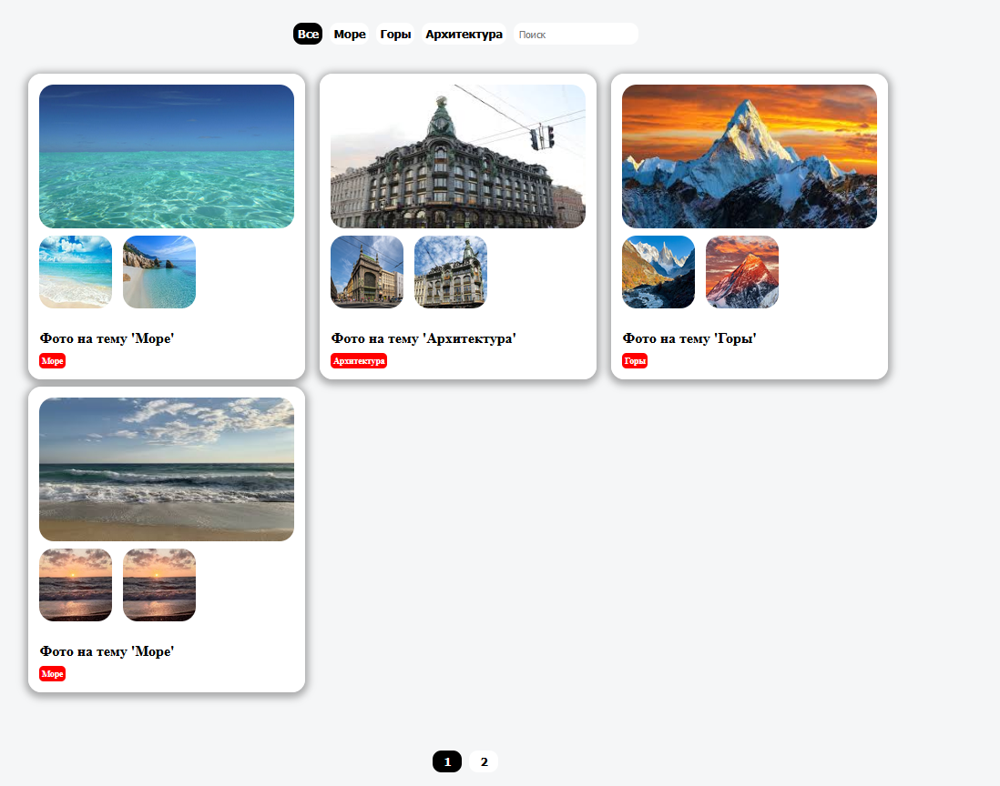

# 🎨 Коллекция фотографий

Веб-приложение на React + TypeScript, предназначенное для работы с коллекциями фотографий. Приложение позволяет просматривать фотографии по тегу, искать по названию. Реализована пагинация. 

---

## 🚀 Используемый стек

  

 

---